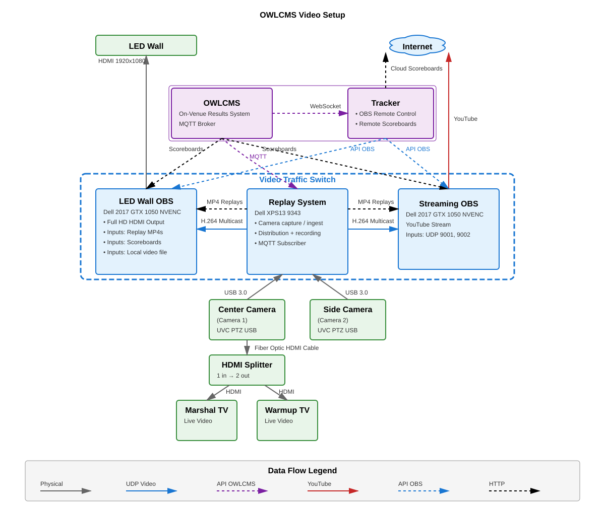
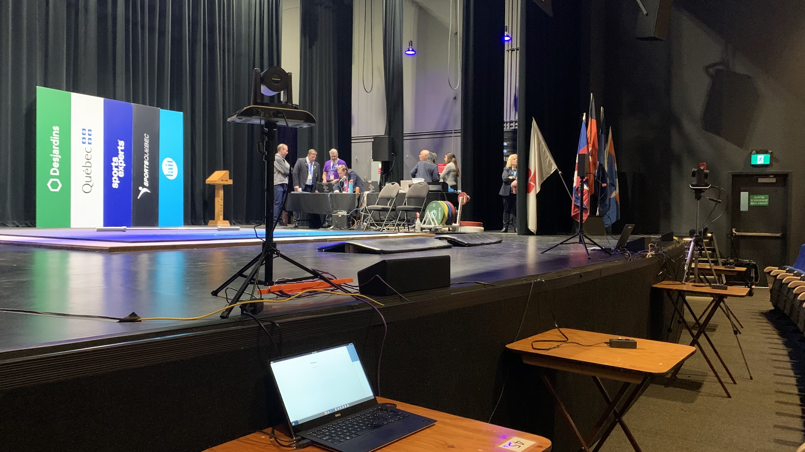
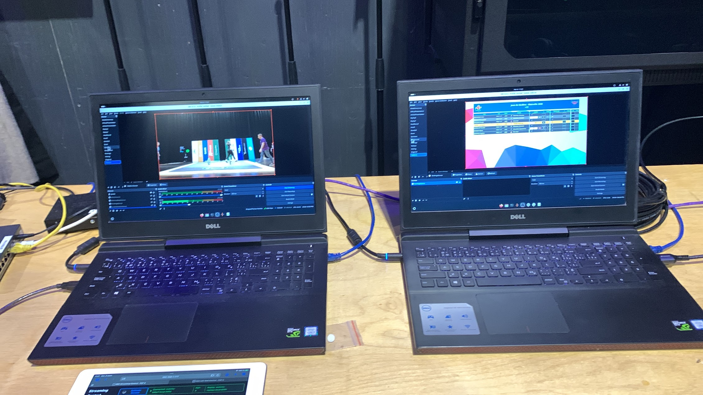
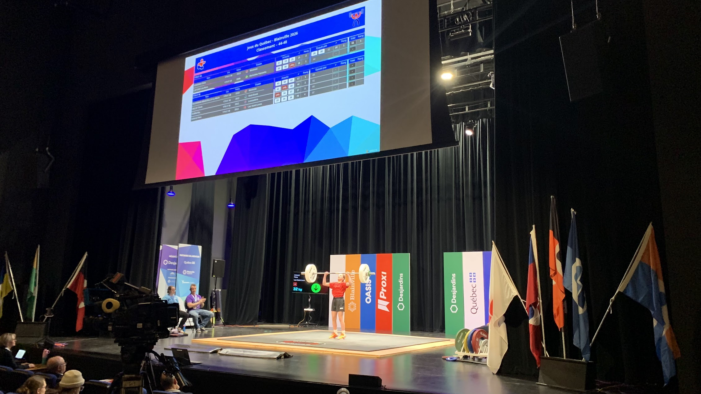
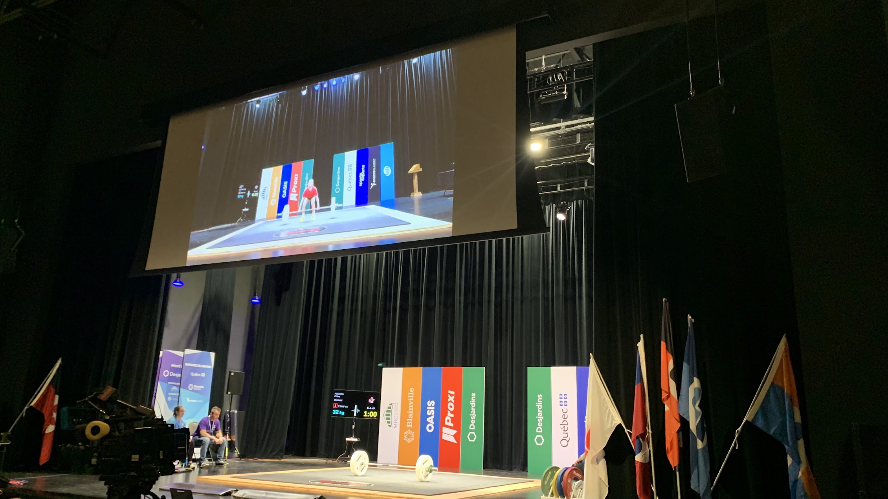

# OWLCMS Video

*Posted on April 04, 2026*

In the recent months, I have been working on doing a revamped setup for webcasting and replays for OWLCMS.  I ended up with a setup like the following.

- A camera capture subsystem gets video from the cameras and re-casts it as a H.264 compressed stream
- The replay system starts and stops copying from the streams based on the instructions from OWLCMS on its MQTT device streams.  This yields H.264 videos wrapped as mp4
- The OBS systems also read the H.264 streams and are remote controlled over a websocket by an application written using owlcms-trakcker (this automates many of the scene changes, and the operator only needs to pick the better camera angle).  
- OBS can get the mp4 replays from the replay system

## The key?  ffmpeg

What is interesting is that all the camera captures, file captures, and even the processing that OBS does internally is based on ffmpeg, an open source software.

ffmpeg works on Windows, Linux and Rpi.  On Mac too but I have not dared use it without access to an actual Mac.  Why?  Each graphic card and and each graphic library apparently adds new configuration options to the software. The only way to get reasonable starting configurations and figure out all the incompatible combinations and arcane error messages has been to rely on AI.

## The results: it works nicely

We connected affordable 60fps 1920x1080 PTZ cams with USB and HDMI output (Tenveo) to a reclaimed laptop on which we installed Ubuntu.  That laptop ran the cameras and the replay system (Center blue box in the diagram)

The streams were connected to two OBS laptops (reclaimed 2017 gaming laptops with old basic NVidia GPUs).  In the front the web application used to automate the scene switching and remote control the OBS, accessed on a tablet.

The left OBS handled the broadcasting, the right OBS handled the display to the audience.  In the room, we would show the board most of the time, and switch to replays after each lift.

Having live replays after each lift improved the experience greatly.  The audience often could see what they had missed and why a lift had been turned down.

